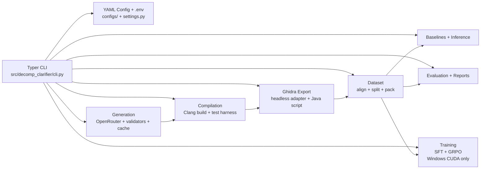
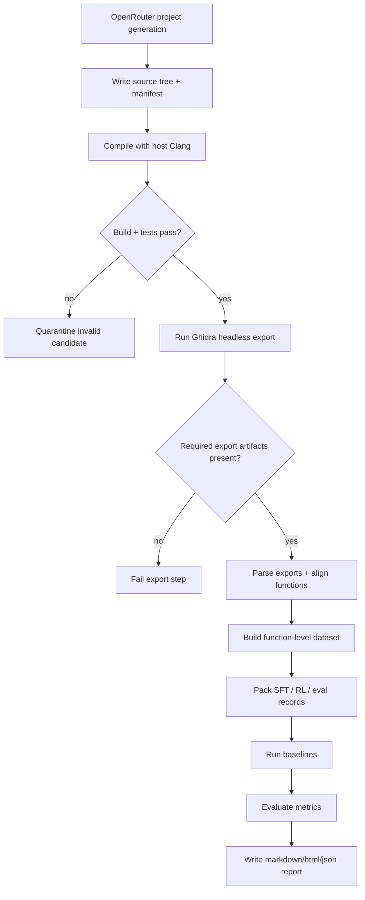
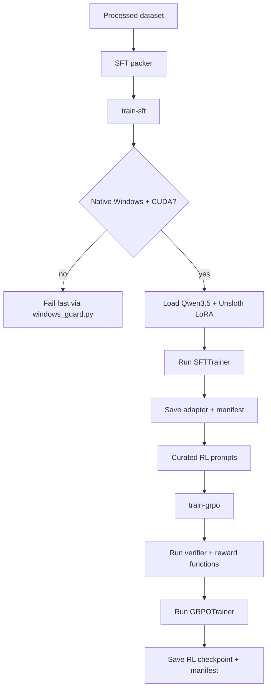
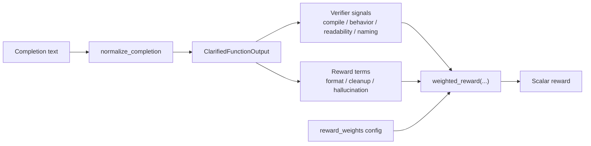
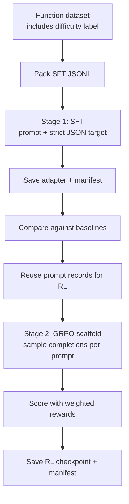
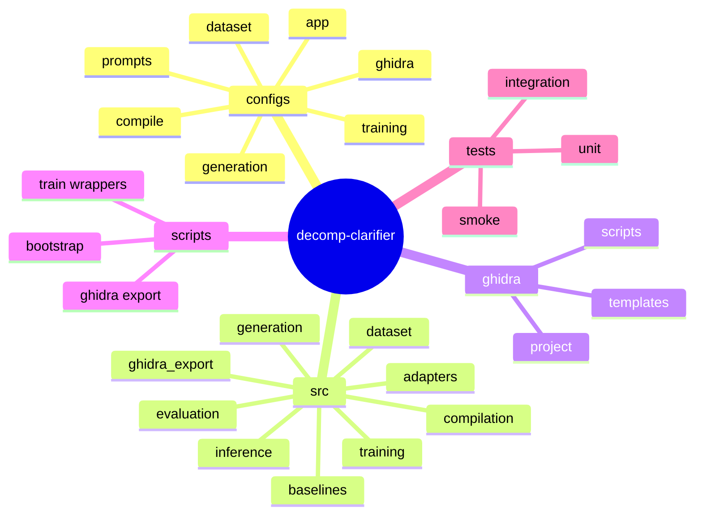

# decomp-clarifier

`decomp-clarifier` is a local research prototype for binary-grounded decompiler clarification. It turns synthetic C projects into binaries, exports Ghidra artifacts, assembles function-level datasets, runs baseline cleanup flows, and provides a guarded Windows CUDA training path for Qwen3.5 + Unsloth SFT/GRPO experiments.

## Status

This repository implements the scaffold and cross-platform core pipeline described in [SPEC.md](SPEC.md):

- config-driven Typer CLI
- OpenRouter-backed synthetic project generation with caching
- host-native Clang compilation and test execution
- Ghidra headless orchestration and export parsing
- function-level dataset assembly, packing, baselines, evaluation, and report generation
- Windows-only guarded training entry points and reward/verifier utilities

Implemented vs validated:

- Phases `0` through `4` are implemented and validated on macOS.
- Phase `5` SFT is implemented as a guarded Windows CUDA path, but it has not been run end-to-end on this macOS machine.
- Phase `6` GRPO is implemented as a guarded Windows CUDA path, but it has not been run end-to-end on this macOS machine.

## Repo Architecture



## Core Flow



## Training Flow



## Reward Functions

The intended GRPO reward stack lives under `src/decomp_clarifier/training/grpo/`. It is designed to combine verifier-backed safety checks with readability-oriented incentives, while keeping compile and behavior signals higher priority than polish.



Current reward components:

| Component | Range | What it rewards | Current implementation |
|---|---|---|---|
| `format` | `0.0`, `0.5`, or `1.0` | Structured JSON output | Gives full credit to strict JSON and partial credit when valid JSON is extractable from wrapper text |
| `cleanup` | `0.0` to `1.0` | Removal of Ghidra placeholder names | Compares placeholder count before vs after for tokens like `param_*`, `local_*`, `iVar*`, `uVar*` |
| `naming` | `0.0` to `1.0` | Better identifier recovery | Uses normalized similarity against the synthetic target rename map |
| `compile` | `0` or `1` | Syntactic validity | Runs `clang -fsyntax-only` on the candidate with includes copied from the reference source |
| `behavior` | `0.0` to `1.0` | Semantic plausibility | Uses project test pass rate when `tests_ref` resolves to a generated project manifest, and otherwise falls back to the older token-overlap proxy |
| `readability` | `0.0` to `1.0` | Easier-to-read code | Rewards readability improvement over raw decompiler text, penalizing long lines, placeholders, and `goto` usage |
| `signature` | `0.0` to `1.0` | Preserves the original function shape | Rewards matching function name, arity, return type, and exact normalized signature |
| `hallucination_penalty` | `0.0+` penalty | Fewer invented calls | Penalizes calls not present in the binary-grounded imports/callees context |
| `decompiler_type_penalty` | `0.0+` penalty | Fewer Ghidra pseudo-types | Penalizes artifacts like `undefined8`, `ulong64`, `ulonglong`, and `longlong` |

Default GRPO weights from `configs/training/grpo_qwen35_2b.yaml`:

| Weight key | Default |
|---|---|
| `format` | `0.5` |
| `cleanup` | `1.5` |
| `naming` | `1.0` |
| `compile` | `3.0` |
| `behavior` | `3.0` |
| `readability` | `0.75` |
| `signature` | `1.25` |
| `hallucination_penalty` | `1.5` |
| `decompiler_type_penalty` | `1.5` |

Important status note:

- GRPO now prefers project-level compile-and-test execution when the packed RL record carries a resolvable `tests_ref`; otherwise it falls back to the older similarity proxy.
- Cleanup, naming, and readability bonuses are now staged behind compile and behavior success rather than being multiplied into all outputs.
- The reward stack also includes a completion-length floor so short stub outputs do not collect positive reward from schema or signature terms alone.
- GRPO now uses a shorter RL-specific prompt than SFT so rollout prompts fit within the 12 GB profile without truncating most samples.
- Both training entry points now emit per-step JSONL/CSV logs, TensorBoard event logs, and PNG telemetry plots under each run's `model/` directory.

## Training Curriculum

The current curriculum is phase-based, not a full automatic easy-to-hard scheduler yet. The repo already preserves `difficulty` labels in the function dataset, but those labels are not yet used to reweight or stage batches during training.



Current training stages:

1. `build-dataset` creates function-level rows with decompiled code, assembly, strings, imports, call context, rename targets, summaries, and a `difficulty` label.
2. `pack_sft_records()` turns each row into a binary-grounded prompt plus a strict JSON target containing `summary`, `confidence`, `renamings`, and `cleaned_c`.
3. `train-sft` concatenates `prompt` and `response_json` into a single training text sample and runs `SFTTrainer` on the Windows CUDA path.
4. The intended next gate is to compare the SFT checkpoint against raw and prompt-only baselines before starting RL.
5. `train-grpo` reuses the packed records, extracts the prompt field, generates multiple completions per prompt, and scores them with the weighted reward stack above.
6. `train-sft` writes loss telemetry, and `train-grpo` writes reward telemetry, as JSONL/CSV logs plus TensorBoard and PNG artifacts.
7. `eval-sft-checkpoint` and `eval-grpo-checkpoint` load a finished checkpoint, generate predictions over a held-out split, score them with the verifier stack, and write side-by-side inspection samples.

Current SFT defaults in `configs/training/sft_qwen35_2b.yaml`:

| Setting | Default |
|---|---|
| Base model | `Qwen/Qwen3.5-2B` |
| Loader | `unsloth` |
| Quantization | `4-bit` |
| LoRA rank | `8` |
| Max sequence length | `2048` |
| Batch size | `1` |
| Gradient accumulation | `4` |
| Epochs | `1` |

Canonical training profiles now include `sft_qwen35_2b`, `sft_qwen35_4b`, `sft_gemma4_e2b_it`, `sft_gemma4_e4b_it` plus matching `grpo_*` profiles.

To run the full model matrix end to end:

```powershell
.\scripts\run_training_matrix.ps1
```

That orchestration script trains all four SFT profiles, all four GRPO profiles, evaluates all eight checkpoints, and refreshes both `artifacts/reports/model_matrix_summary.*` and `artifacts/reports/target_comparison_table.*`.

What is not wired yet:

- no automatic difficulty curriculum that ramps from easy to hard samples
- no staged sampler that uses the dataset `difficulty` field
- no CLI gate that automatically promotes a checkpoint from SFT to GRPO based on eval thresholds

## Repository Layout



## Quick Start

### macOS / Linux

```bash
./scripts/bootstrap.sh
source .venv/bin/activate
python -m decomp_clarifier.cli doctor
PYTHONPATH=src python -m decomp_clarifier.cli --help
```

### Windows / PowerShell

Core pipeline only:

```powershell
./scripts/bootstrap.ps1
.\.venv\Scripts\Activate.ps1
$env:PYTHONPATH = (Resolve-Path .\src).Path
python -m decomp_clarifier.cli doctor
python -m decomp_clarifier.cli --help
```

Windows CUDA training:

```powershell
./scripts/bootstrap.ps1 -Training
.\.venv\Scripts\Activate.ps1
$env:PYTHONPATH = (Resolve-Path .\src).Path
.\scripts\verify_train_env.ps1
python -m decomp_clarifier.cli train-sft --help
python -m decomp_clarifier.cli train-grpo --help
```

If `.\scripts\verify_train_env.ps1` shows `torch ... +cpu` or `CUDA is not available`,
repair the project venv with the official CUDA wheels:

```powershell
uv pip install --python .\.venv\Scripts\python.exe --reinstall torch==2.10.0 torchvision==0.25.0 --index-url https://download.pytorch.org/whl/cu128
.\scripts\verify_train_env.ps1
```

Use [pipeline_run.md](pipeline_run.md) for the full manual end-to-end runbook and verification checklist.

## Common Commands

```bash
PYTHONPATH=src python -m decomp_clarifier.cli generate-projects --count 5
PYTHONPATH=src python -m decomp_clarifier.cli compile-projects
PYTHONPATH=src python -m decomp_clarifier.cli export-ghidra
PYTHONPATH=src python -m decomp_clarifier.cli build-dataset
PYTHONPATH=src python -m decomp_clarifier.cli run-baselines
PYTHONPATH=src python -m decomp_clarifier.cli eval
PYTHONPATH=src python -m decomp_clarifier.cli report
PYTHONPATH=src python -m decomp_clarifier.cli doctor
PYTHONPATH=src python -m decomp_clarifier.cli doctor --training

python -m decomp_clarifier.cli generate-projects --count 5
python -m decomp_clarifier.cli compile-projects
python -m decomp_clarifier.cli export-ghidra
python -m decomp_clarifier.cli build-dataset
python -m decomp_clarifier.cli run-baselines
python -m decomp_clarifier.cli eval
python -m decomp_clarifier.cli report
python -m decomp_clarifier.cli doctor
python -m decomp_clarifier.cli doctor --training
python -m decomp_clarifier.cli train-sft
python -m decomp_clarifier.cli train-grpo
python -m decomp_clarifier.cli eval-sft-checkpoint
python -m decomp_clarifier.cli eval-grpo-checkpoint
```

Training commands are intentionally guarded and will fail fast on unsupported environments. On Windows CUDA hosts, `doctor --training` validates the stack before you start a long run.
`train-grpo` defaults to the latest completed SFT checkpoint when the profile leaves `base_model_id` unset, and `eval-grpo-checkpoint` now defaults to `384` decode tokens to match the GRPO rollout budget.
`generate-projects` now makes one structured repair attempt with a stronger model before quarantining a compile- or test-failing project, and the run `metrics.json` includes `repaired_count`.

Checkpoint evaluation writes:

- `predictions.jsonl`
- `sample_evaluations.jsonl`
- report markdown/html/json
- `comparison.md` with a metric table against the latest baseline run when available
- `inspection_samples.md` and `inspection_samples.jsonl` with original source, Ghidra decompilation, and reconstructed output

`run-baselines` can now also benchmark optional comparator systems:

- `--generation-model-id` for the model family used to generate training data
- `--strong-model-id` for a stronger API reference
- `--base-model-id` for a pre-fine-tune local model baseline such as `Qwen/Qwen3.5-2B`

Baseline prediction JSONL now carries `json_valid` and `raw_text` so checkpoint and baseline comparisons can treat malformed outputs correctly. Invalid-JSON checkpoint samples now contribute `0.0` to behavior and naming metrics instead of leaking verifier wins through fallback text.

Windows convenience wrappers:

```powershell
.\scripts\eval_sft_checkpoint.ps1
.\scripts\eval_grpo_checkpoint.ps1
```

## Phase Coverage

| Phase | Status | Notes |
|---|---|---|
| 0. Scaffold/tooling/tests | Implemented and validated | Ruff, pytest, coverage gate in place |
| 1. OpenRouter generation | Implemented and validated | Includes cache, `.env` loading, one repair pass before quarantine, and repaired/quarantined metrics |
| 2. Compile + Ghidra export | Implemented and validated | Uses host Clang and local headless Ghidra |
| 3. Dataset builder | Implemented and validated | Function-level rows, split logic, SFT packing |
| 4. Baselines + reporting | Implemented and validated | Raw, naming-only, prompt-only cleanup, report generation |
| 5. SFT | Implemented, not runtime-validated here | Guarded Windows CUDA path using Unsloth + TRL |
| 6. GRPO | Implemented, not runtime-validated here | Guarded Windows CUDA path with weighted reward logging and telemetry artifacts |
| 7. Demo CLI | Implemented and validated | `demo`, `eval`, and `report` run on macOS |

## Ghidra

The included [run_headless_analysis.command](run_headless_analysis.command) reflects a local macOS setup and was used to shape the default headless adapter. Override the install path with either:

- `DECOMP_CLARIFIER_COMPILER_EXECUTABLE` for an explicit Clang path when `clang` is not on `PATH`
- `DECOMP_CLARIFIER_GHIDRA_DIR`
- `DECOMP_CLARIFIER_GHIDRA_ANALYZE_HEADLESS`
- `configs/ghidra/default.yaml`

On Windows, the compiler adapter also probes common LLVM installs under `C:\Program Files\LLVM\bin` and Visual Studio's `VC\Tools\Llvm\...\bin` directories before failing.

After setting compiler or Ghidra paths, rerun `python -m decomp_clarifier.cli doctor` to verify discovery.

## Testing

```bash
pytest --cov=src/decomp_clarifier --cov-config=coverage.toml --cov-report=term-missing --cov-fail-under=90
```
