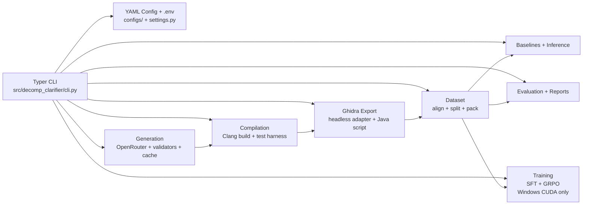
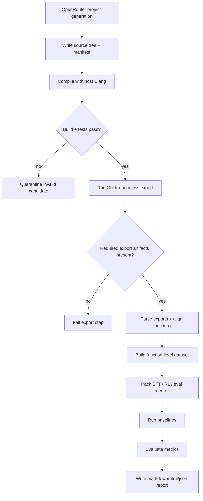
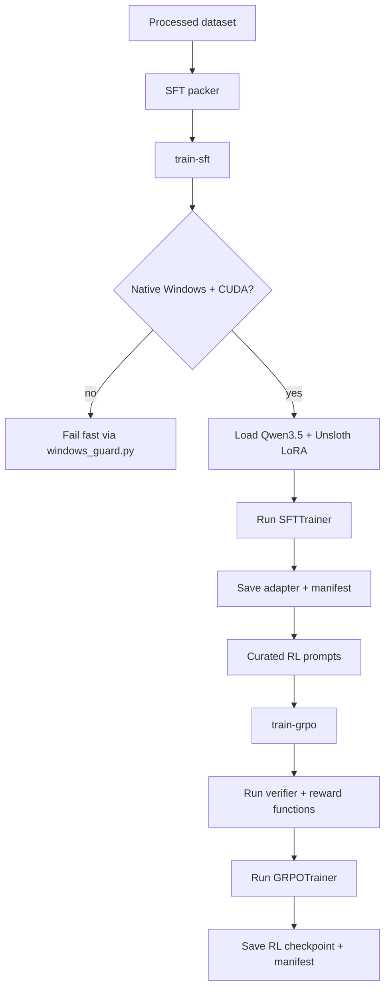
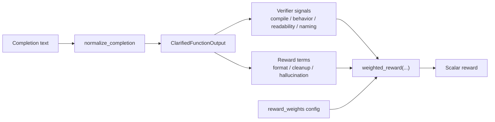
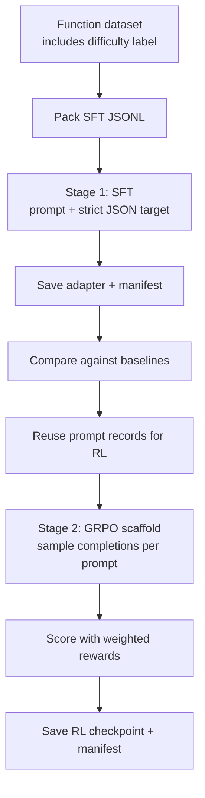
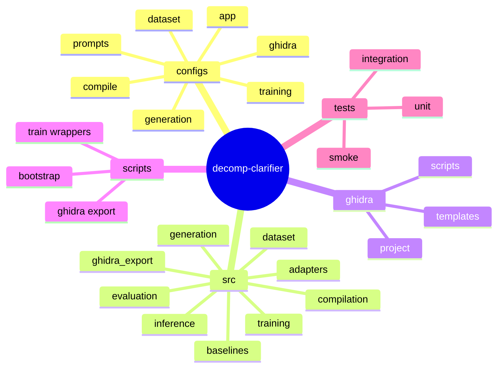

# decomp-clarifier

`decomp-clarifier` is a local research prototype for binary-grounded decompiler clarification. It turns synthetic C projects into binaries, exports Ghidra artifacts, assembles function-level datasets, runs baseline cleanup flows, and provides a guarded Windows CUDA training path for Qwen3.5 + Unsloth SFT/GRPO experiments.

## Status

This repository implements the scaffold and cross-platform core pipeline described in [SPEC.md](SPEC.md):

- config-driven Typer CLI
- OpenRouter-backed synthetic project generation with caching
- host-native Clang compilation and test execution
- Ghidra headless orchestration and export parsing
- function-level dataset assembly, packing, baselines, evaluation, and report generation
- Windows-only guarded training entry points and reward/verifier utilities

Implemented vs validated:

- Phases `0` through `4` are implemented and validated on macOS.
- Phase `5` SFT is implemented as a guarded Windows CUDA path, but it has not been run end-to-end on this macOS machine.
- Phase `6` GRPO is implemented as a guarded Windows CUDA path, but it has not been run end-to-end on this macOS machine.

## Repo Architecture



## Core Flow



## Training Flow



## Reward Functions

The intended GRPO reward stack lives under `src/decomp_clarifier/training/grpo/`. It is designed to combine verifier-backed safety checks with readability-oriented incentives, while keeping compile and behavior signals higher priority than polish.



Current reward components:

| Component | Range | What it rewards | Current implementation |
|---|---|---|---|
| `format` | `0` or `1` | Non-empty structured output | Requires both `summary` and `cleaned_c` to be non-empty |
| `cleanup` | `0.0` to `1.0` | Removal of Ghidra placeholder names | Compares placeholder count before vs after for tokens like `param_*`, `local_*`, `iVar*`, `uVar*` |
| `naming` | `0.0` to `1.0` | Better identifier recovery | Uses normalized similarity against the synthetic target rename map |
| `compile` | `0` or `1` | Syntactic validity | Runs `clang -fsyntax-only` on the candidate with includes copied from the reference source |
| `behavior` | `0` or `1` | Semantic plausibility | Uses a token-overlap proxy and currently passes at `>= 0.35` similarity |
| `readability` | `0.0` to `1.0` | Easier-to-read code | Rewards readability improvement over raw decompiler text, penalizing long lines, placeholders, and `goto` usage |
| `hallucination_penalty` | `0.0+` penalty | Fewer invented calls | Penalizes calls not present in the binary-grounded imports/callees context |

Default GRPO weights from `configs/training/grpo_qwen35_4b.yaml`:

| Weight key | Default |
|---|---|
| `format` | `1.0` |
| `cleanup` | `1.5` |
| `naming` | `1.5` |
| `compile` | `2.0` |
| `behavior` | `3.0` |
| `readability` | `1.0` |
| `hallucination_penalty` | `2.0` |

Important status note:

- The current `compile` and `behavior` checks are conservative proxies, not full recompilation and differential execution against the original binary yet.
- Both training entry points now emit per-step JSONL/CSV logs, TensorBoard event logs, and PNG telemetry plots under each run's `model/` directory.

## Training Curriculum

The current curriculum is phase-based, not a full automatic easy-to-hard scheduler yet. The repo already preserves `difficulty` labels in the function dataset, but those labels are not yet used to reweight or stage batches during training.



Current training stages:

1. `build-dataset` creates function-level rows with decompiled code, assembly, strings, imports, call context, rename targets, summaries, and a `difficulty` label.
2. `pack_sft_records()` turns each row into a binary-grounded prompt plus a strict JSON target containing `summary`, `confidence`, `renamings`, and `cleaned_c`.
3. `train-sft` concatenates `prompt` and `response_json` into a single training text sample and runs `SFTTrainer` on the Windows CUDA path.
4. The intended next gate is to compare the SFT checkpoint against raw and prompt-only baselines before starting RL.
5. `train-grpo` reuses the packed records, extracts the prompt field, generates multiple completions per prompt, and scores them with the weighted reward stack above.
6. `train-sft` writes loss telemetry, and `train-grpo` writes reward telemetry, as JSONL/CSV logs plus TensorBoard and PNG artifacts.

Current SFT defaults in `configs/training/sft_qwen35_4b.yaml`:

| Setting | Default |
|---|---|
| Base model | `Qwen/Qwen3.5-4B` |
| Loader | `unsloth` |
| Quantization | `4-bit` |
| LoRA rank | `16` |
| Max sequence length | `4096` |
| Batch size | `2` |
| Gradient accumulation | `8` |
| Epochs | `2` |

Hardware overlays are available in `configs/training/windows_cuda_16gb.yaml`, `configs/training/windows_cuda_24gb.yaml`, and `configs/training/windows_cuda_48gb.yaml` to reduce or expand sequence length and batch size for different GPUs.

What is not wired yet:

- no automatic difficulty curriculum that ramps from easy to hard samples
- no staged sampler that uses the dataset `difficulty` field
- no CLI gate that automatically promotes a checkpoint from SFT to GRPO based on eval thresholds

## Repository Layout



## Quick Start

### macOS / Linux

```bash
./scripts/bootstrap.sh
source .venv/bin/activate
PYTHONPATH=src python -m decomp_clarifier.cli --help
```

### Windows / PowerShell

```powershell
./scripts/bootstrap.ps1
.\.venv\Scripts\Activate.ps1
$env:PYTHONPATH = (Resolve-Path .\src).Path
python -m decomp_clarifier.cli --help
```

## Common Commands

```bash
PYTHONPATH=src python -m decomp_clarifier.cli generate-projects --count 5
PYTHONPATH=src python -m decomp_clarifier.cli compile-projects
PYTHONPATH=src python -m decomp_clarifier.cli export-ghidra
PYTHONPATH=src python -m decomp_clarifier.cli build-dataset
PYTHONPATH=src python -m decomp_clarifier.cli run-baselines
PYTHONPATH=src python -m decomp_clarifier.cli eval
PYTHONPATH=src python -m decomp_clarifier.cli report

python -m decomp_clarifier.cli generate-projects --count 5
python -m decomp_clarifier.cli compile-projects
python -m decomp_clarifier.cli export-ghidra
python -m decomp_clarifier.cli build-dataset
python -m decomp_clarifier.cli run-baselines
python -m decomp_clarifier.cli eval
python -m decomp_clarifier.cli report
python -m decomp_clarifier.cli train-sft
python -m decomp_clarifier.cli train-grpo
```

Training commands are intentionally guarded and will fail fast on non-Windows or non-CUDA environments:

```bash

```

## Phase Coverage

| Phase | Status | Notes |
|---|---|---|
| 0. Scaffold/tooling/tests | Implemented and validated | Ruff, pytest, coverage gate in place |
| 1. OpenRouter generation | Implemented and validated | Includes cache, `.env` loading, quarantine on invalid projects |
| 2. Compile + Ghidra export | Implemented and validated | Uses host Clang and local headless Ghidra |
| 3. Dataset builder | Implemented and validated | Function-level rows, split logic, SFT packing |
| 4. Baselines + reporting | Implemented and validated | Raw, naming-only, prompt-only cleanup, report generation |
| 5. SFT | Implemented, not runtime-validated here | Guarded Windows CUDA path using Unsloth + TRL |
| 6. GRPO | Implemented, not runtime-validated here | Guarded Windows CUDA path with weighted reward logging and telemetry artifacts |
| 7. Demo CLI | Implemented and validated | `demo`, `eval`, and `report` run on macOS |

## Ghidra

The included [run_headless_analysis.command](run_headless_analysis.command) reflects a local macOS setup and was used to shape the default headless adapter. Override the install path with either:

- `DECOMP_CLARIFIER_COMPILER_EXECUTABLE` for an explicit Clang path when `clang` is not on `PATH`
- `DECOMP_CLARIFIER_GHIDRA_DIR`
- `DECOMP_CLARIFIER_GHIDRA_ANALYZE_HEADLESS`
- `configs/ghidra/default.yaml`

On Windows, the compiler adapter also probes common LLVM installs under `C:\Program Files\LLVM\bin` and Visual Studio's `VC\Tools\Llvm\...\bin` directories before failing.

## Testing

```bash
pytest --cov=src/decomp_clarifier --cov-config=coverage.toml --cov-report=term-missing --cov-fail-under=90
```
